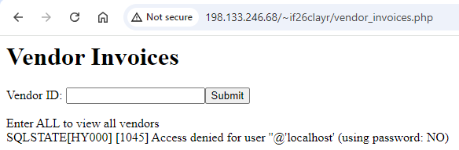
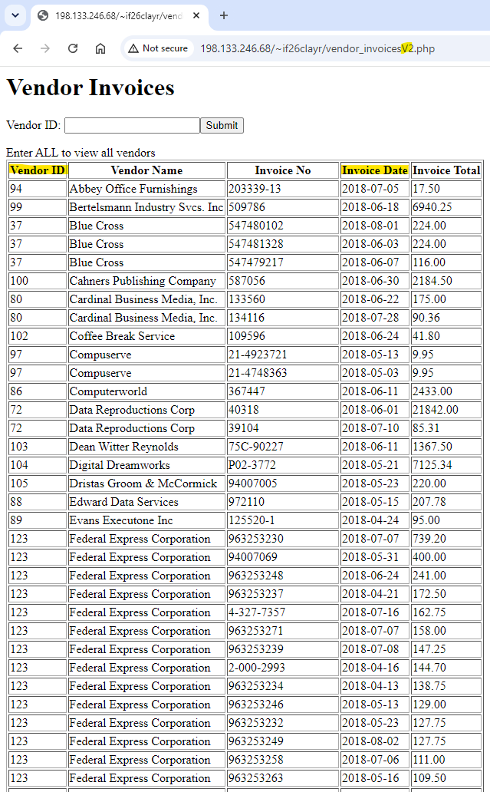
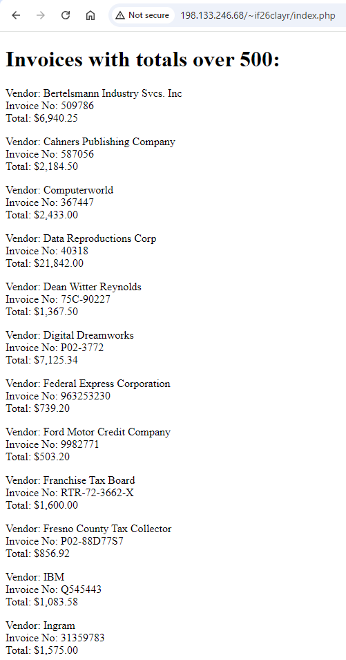
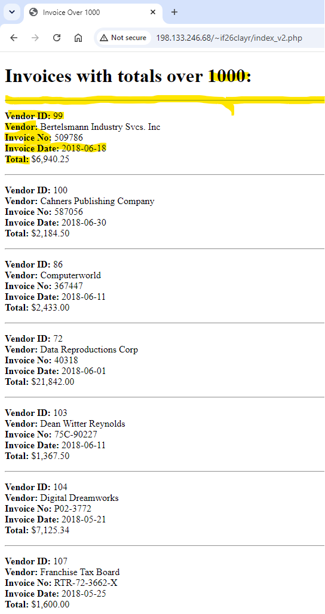

# MySQL Chapter2 - Dynamic Web Page
___

## Overview
___
ADDME

## Table of Contents
___
* [New Concepts](#new-concepts)
* [Tech Stack](#tech-stack)
* [Installation](#installation)
* [Running Output](#running-output)
* [Learning Outcomes](#learning-outcomes)
* [Help](#help)
* [Author](#author)

### New Concepts
___
* ADDME
* ADDME
* ADDME
* ADDME

### Learning Outcomes
___
ADDME

## Tech Stack
___

## Installation
___
1. Clone the repository to your local machine. (or just steal my code)
2. Put the code into VS Code in your mainframe of choice

## Running Output
___
* Vendor Invoices Before

* Vendor Invoices After

* Invoice Before

* Invoice After

## Help
___
* Make sure compiler is running correctly.
* Potentially re-clone repository
* restart IDE

## Author
___

**Clay Rasmussen**
* **Clay's GitHub Profile**: [Clay-Rasmussen](https://github.com/Clay-Rasmussen)
* **Clay's Email**: [clrasm02@wsc.edu](mailto:clrasm02@wsc.edu)
___

[Back to the top](#overview)
